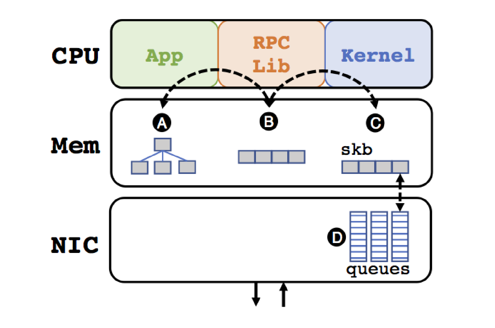
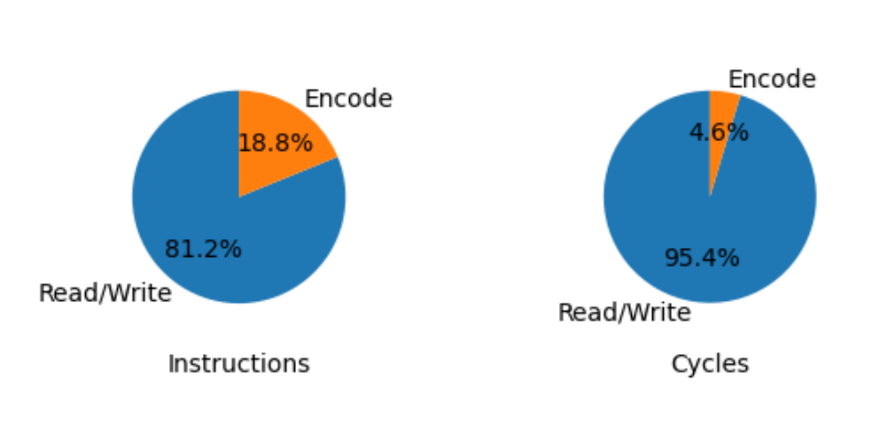
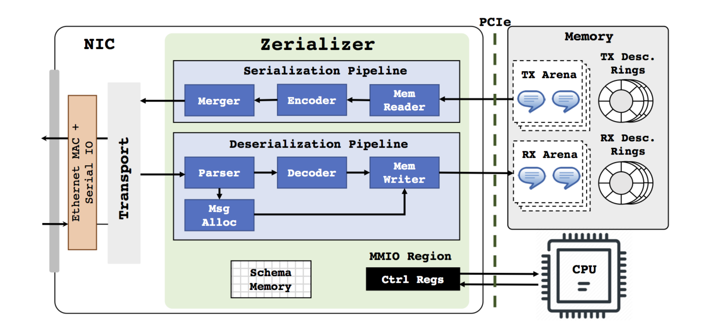

> 翻译自文档： [Zerializer: Towards Zero-Copy Serialization](https://www.cs.yale.edu/homes/soule/pubs/hotos2021.pdf)，该论文发表于2021年5月。

## 摘要 

实现零拷贝（zero-copy）I/O一直是网络社区的重要目标。然而，数据序列化使零拷贝I/O的好处不复存在，因为它需要CPU读取、转换和写入消息数据，导致真实对象实例和连续的套接字缓冲区之间出现额外的内存拷贝。因此，我们主张通过专门的硬件将序列化逻辑卸载到 DMA 路径上。我们为这样一个加速器提出了一个初步的硬件设计，并给出了其可行性和预期收益的初步证据。

## 关键字 

序列化，网卡，直接内存访问

## 第一章：介绍

图1：传统网络堆栈中的内存拷贝。

实现零拷贝I/O一直是网络社区的重要目标。今天，一些操作系统和网卡已经能够通过各种技术[34]实现这一目标，包括直接内存访问（direct memory access / DMA）和通过内存管理单元进行内存映射。

> 这些技术和本建议都不能真正确保零拷贝。至少，它们需要一个内存拷贝来访问主内存，读取对象实例，并将其复制到NIC内存中。我们使用的零拷贝一词纯粹是从CPU的角度出发。CPU内核不参与任何内存拷贝操作。

然而，应用级的序列化给零拷贝I/O带来了挑战。通过应用级序列化，我们指的是将数据结构的内存表示转换为在网络上传输的架构和语言独立的格式的过程。分布式应用在从一台机器向另一台机器发送数据时，通常依赖序列化库，如谷歌的 Protocol Buffers（Protobuf）[29]或 Apache Thrift [2]。问题是，应用级的序列化编码需要CPU读取、转换和写入消息数据，导致真实的对象实例和连续的缓冲区之间产生额外的内存拷贝。图1说明了应用级序列化所需的大量内存拷贝，从内存中的 RPC 对象（A）开始，到编码的RPC消息（B），到内核套接字缓冲区（C），再到网卡队列（D）。

这些额外的内存拷贝是一个巨大的开销来源，因此，应用程序级的序列化是系统性能的最广泛认可的瓶颈之一。作为一个典型的例子，Kanev等人[16]报告说，在谷歌，序列化和RPC在所有的应用程序中消耗12%的周期（fleet cycle）。事实上，它们被称为 "数据中心税"，也就是说，应用程序必须为在数据中心运行而付出代价。

这种瓶颈不仅仅是源于低效的操作（我们将在第2节中论证在CPU上实现序列化是低效的），也是由于调用的频率。软件工程中新出现的微服务和serverless/函数计算的趋势，主张对软件模块进行细粒度的分解，使这个问题更加严重。调用一个听起来无害的方法，getX，可能会导致成百上千的RPC调用，每一个都需要数据序列化。其结果就是传说中的千刀万剐。

为了真正实现高性能的消息传输，我们必须解决这个瓶颈，并消除额外的内存拷贝。标准的DMA技术是不够的，因为序列化不仅需要内存拷贝，还需要数据转换。因此，我们认为，应用层的消息处理逻辑应该被添加到DMA路径中。

当然，在网卡硬件上增加一个序列化加速器的前提是网络传输协议也被卸载了。传输协议卸载本身一直是一个长期争论的话题[24]。问题是，卸载到网卡的潜在性能优势是否超过了增加硬件复杂性的成本。然而，摩尔定律的结束，网络速度的提高，以及RDMA的广泛采用，最近导致了对传输协议卸载的重新支持。目前有几个关于卸载网络堆栈和基本网络功能的提案[3, 8, 21]。

我们认为这些面向卸载的第一步走得还不够远，并主张在 SmartNIC 中加入应用层消息处理的硬件（第二章）。我们已经为这样一个加速器开发了一个初步的硬件设计，它使用硬编码的构建块来执行数据转换，以及一个可编程的配置，使它们能够支持特定应用的消息格式（第二章）。我们把我们的设计称为 Zerializer，它允许零拷贝I/O，并在 DMA 路径中增加序列化，或者我们称之为 A 和 D 之间的直接零拷贝序列化。

## 第二章：为什么要卸载序列化

CPU性能的停滞不前已经不可避免地导致了特定领域处理器的采用。这一趋势提出了一对重要的问题。首先，哪些功能可以而且应该从硬件加速或卸载中受益？第二，应该如何将这种功能纳入整体架构中？我们从两个角度考虑这些问题：硬件设计者和软件开发者。从硬件的角度来看，我们希望为那些在不久的将来不太可能改变的功能或逻辑建立定制的硬件，即标准或其他社区已经趋同的组件。从软件的角度来看，我们想加速那些瓶颈的功能。但是，更微妙的是，我们想把重点放在卸载计算上，释放出来的CPU周期可以有效地用于其他方面。

从硬件和软件的角度来看，序列化是硬件加速的一个自然候选者。序列化格式是标准化的，不会经常变化。它们也是一个性能瓶颈。而且，就像零拷贝I/O一样，如果序列化被卸载，CPU可以完全专注于应用逻辑。不过，重要的是，我们认为不仅应该卸载序列化，而且应该在DMA路径上。

**什么是序列化？**序列化是将数据结构的内存表示转换为架构和语言独立的格式，在网络上发送或存储到磁盘的过程。有各种各样的序列化格式，在几个方面有所不同：自我描述与基于模式，基于文本与二进制编码，以及对集合或其他类型的支持。在本文中，我们关注像Protocol Buffers[29] 和 Thrift[2] 这样的序列化库，因为它们被广泛采用。当使用这类库时，开发者使用特定领域的语言定义他们将用于消息的数据结构。编译器将消息规范翻译成可以从应用程序中调用的发送者和接受者代码。这两种序列化格式都是基于模式的二进制编码，支持各种复杂的数据类型，如列表和map。这些结构体可能是嵌套的，而且内存中的表示可能包含指向不同内存位置的指针。序列化过程必须根据名称或位置将指针转换为引用。

**为什么序列化是瓶颈？**当应用程序使用序列化时，它通常是在访问最近通过网络收到的新鲜数据。这需要几个步骤。首先，第一次访问编码后的数据会导致通过内存层次的冷失误（cold miss）--要么到主内存，要么到最后一级缓存，如果网络接口将进入的数据放在最后一级缓存中的话。第二，CPU必须执行计算，对数据进行编码/解码。第三，原生数据必须被写回内存。

当然，这些操作中的每一项的成本都与工作负载和消息有关。然而，为了让大家基本了解这些第一和第三步骤（读和写）相对于第二步骤（编码）的成本，我们对Protobuf的Message类（v3.14.0）的序列化方法 SerializeToOStream 进行了分析，该方法包含三个64位无符号整数的简单消息。这个消息可以代表三维空间中的一个点或一小组数字ID。为了进行测量，我们使用了性能应用编程接口（Performance Application Programming Interface）[25]。

图2显示了以指令和周期为单位的结果，是1000次运行的平均值。我们看到，内存访问在开销中占主导地位。因此，仅仅是加速或卸载数据转换[28]并不能充分解决瓶颈问题。然而，由于必须进行一些计算来进行数据编码，所以单靠 DMA 也不是一个可行的解决方案。

图2：三个64位无符号整数的消息的Protobuf序列化的构成。

**我们能不能只做软件的修改？**多年来，人们提出了各种各样的序列化库和格式，做出了不同的权衡（例如，人类可读性与空间效率，性能与表现力，等等）。众所周知，有些实现方式的性能很差。例如，Java序列化[13]，由于它对反射的依赖。通过谨慎的设计决策，一些性能可以得到改善。Flatbuffers[9] 是 Protobuf 的一个表达能力较弱、效率较高的版本。然而，仅靠软件的改变所能达到的效果是有限的。它们并没有解决额外的内存拷贝这一根本问题。

**为什么不直接使用另一个CPU？**标准的微处理器没有针对编码/解码所需的位级(bit-level)操作进行优化[28]。此外，数据编码也倾向于顺序化。作为一个例子，考虑谷歌 Protobuf 中使用的 varint 编码。该编码使用每个字节中最重要的位来指示下一个字节是否是同一个整数的一部分。这就产生了带有条件分支的顺序依赖链，这对在CPU上有效执行是一个挑战。因此，标准的CPU指令集与序列化并不匹配。

**为什么不增加额外的指令或一个CPU加速器/处理器？**我们可以不使用复杂的CPU，而是用专门针对序列化的特殊指令来增强现有的CPU，以减少计算的开销。在一个极端的情况下，可以用一个专门为序列化任务定制的加速器/协处理器来增强CPU的功能。虽然这解决了计算上的需要，但我们仍然面临着重大的内存系统性能问题。转换必须在DMA路径上进行。

**这与DMA是如何互动的？**考虑到一个传入的数据信息，NIC 可以直接将传入的数据传输到用户空间可访问的缓冲区中。NIC可以使用 DMA 引擎将数据直接传输到主内存和/或最后一级缓存中。

序列化有效地创建了传入数据的第二个副本。编码后的数据在内存层次中上行，处理，然后以解码的形式下行--第二个副本。这就使得缓存的使用效率很低，尤其是在数据只被触及一次就被解码的情况下。因此，有一个应用驱动的CPU/协处理器方法，有效地消除了所有用于消除额外拷贝和实现 "零拷贝"网络接口的工程努力。

**为什么是现在？**随着网络速度达到或超过100Gbps，普通操作在微秒级完成，序列化是开销的一个重要来源。鉴于通用处理器的性能趋于稳定，导致人们对网卡上的传输协议卸载重新产生兴趣，因此有机会通过将序列化/反序列化额外卸载到网卡上，使其位于DMA路径上，从而显著减少这种开销。这是可行的，因为序列化是一种稳定、直接的转换，并不比典型的数据包处理复杂多少。此外，如果我们专注于数据中心内的RPC，序列化卸载将不需要过多的NIC内存，因为NIC只需要以流的方式从主内存中获取满满的带宽延迟积（BDP）的数据。现代数据中心的BDP只有几百KB（例如，100Gbps × 10 usec = 125KB）。

## 第三章：提案设计

图3描述了我们建议如何将 Zerializer 整合到网卡上。

在高层次上，暴露给软件的接口与现代基于DMA的网卡所提供的接口非常相似。然而，应用程序不是传递数据包描述符，而是直接传递RPC消息描述符。RPC消息在传输时被自动序列化，因为它们从主机内存中被DMA化，而在接收时被自动反序列化，因为它们被DMA化到主机内存中。本节更详细地解释了我们提出的软件接口和Zerializer架构。

**初始化**。在发送和接收RPC消息之前，应用程序必须执行几个初始化操作。首先，它必须分配 TX/RX 描述符环以及 TX/RX 区域，并通过配置适当的控制寄存器和MMIO操作将它们注册到 Zerializer。TX和RX区域分别用于存储所有发送和接收的RPC消息对象。为了确保 Zerializer 能够快速访问这些消息对象，主机必须用必要的虚拟到物理地址的转换来填充IO-TLB。请注意，使用传统网卡的现代系统也会执行类似的步骤，以确保 DMA 引擎能够快速访问所有必要的数据包缓冲区。描述符环存储指向 RPC 消息对象的指针，这些对象被分配在TX和RX区域内。每个应用程序使用一对单独的描述符环和区域。

接下来，应用程序描述它希望在特定领域语言（DSL）中使用的RPC消息的格式，如Protobuf [29]。然后，消息格式的DSL定义被编译成我们所说的消息模式，它必须被加载到 Zerializer 模块。这个模式被用来正确地序列化和反序列化RPC消息。

**消息传输（序列化）**。在RPC消息可以被传输之前，它必须在内存中构建。应用程序将首先从TX场分配一个消息对象并初始化其字段。为了传输，应用程序创建一个TX描述符，将其添加到TX描述符环中，并使用MMIO写操作通知Zerializer。该描述符包括一个指向消息对象的指针、消息类型以及一个状态位。

收到传输请求后，内存读取器首先从TX描述符环中获取描述符。然后，利用信息模式的知识，它获取信息的每个字段。在每个字段被获取后，Zerializer通过更新消息描述符中的状态位来标志消息的完成。这个信号告诉应用程序，它现在被允许回收消息缓冲区的空间。

每个字段在编码器中都是独立转换的。每个字段使用的数据转换逻辑是由字段类型决定的，而字段类型是在信息模式中指定的。编码器包含专门的硬件来转换每个字段类型；它包含足够数量的并行硬件资源，以确保编码逻辑不会成为系统的吞吐量瓶颈。序列化流水线末端的合并模块将转换后的字段累积起来，并将其合并为最终的编码信息。然后，编码后的消息被传递到NIC的传输层，以便通过网络传递到目的地。

这种架构极大地提高了序列化的性能，因为它明确地以并行方式读取和转换每个字段。在传统的基于软件的序列化中，只有当CPU能够在指令流中推测到足够远的位置时，才会对消息字段进行并行操作，这在现代处理器上是不可能的[28]。

**消息接收（反序列化）**：NIC传输层将数据包重新组合成线格式（wire-format ）的消息，并将其传递给 Zerializer 进行解码。解析器模块识别消息类型并通知消息分配器。标准的网卡会将数据包 DMA 到一个或多个由主机软件预先分配的缓冲区。这种方法对数据包很有效，因为数据包被简单地视为一串原始字节，多个缓冲区可以连接在一起以存储整个数据包。然而，RPC消息对象必须以一种非常特殊的格式在内存中布置，以便对应用程序有用。除非主机确切地知道它在任何时候需要处理多少种消息类型，否则使用预先分配的消息对象将可能导致内存资源的使用效率非常低。如果要求主机软件在每个RPC通过网络到达时为其分配一个消息对象，那么NIC将无法立即将解码的消息送入主机内存。为了避免这些问题，我们选择让Zerializer管理RX领域的消息对象分配。最近的工作表明，硬件中的内存分配是快速和廉价的[17]。

